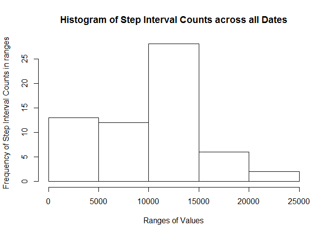
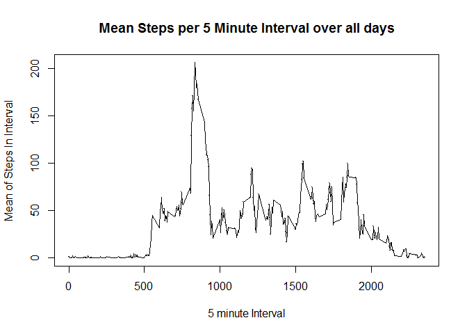
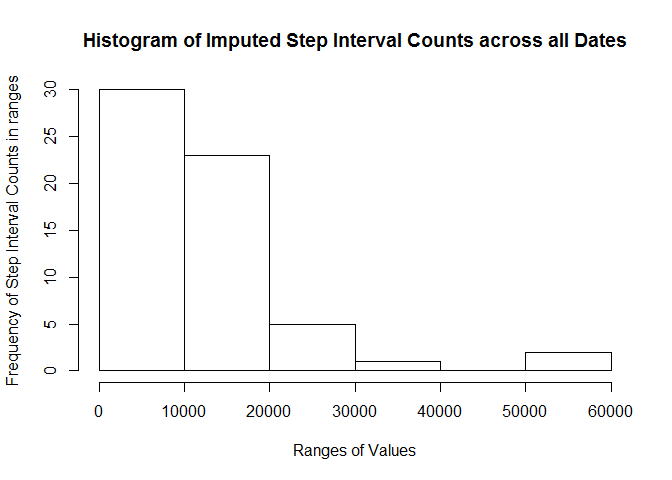
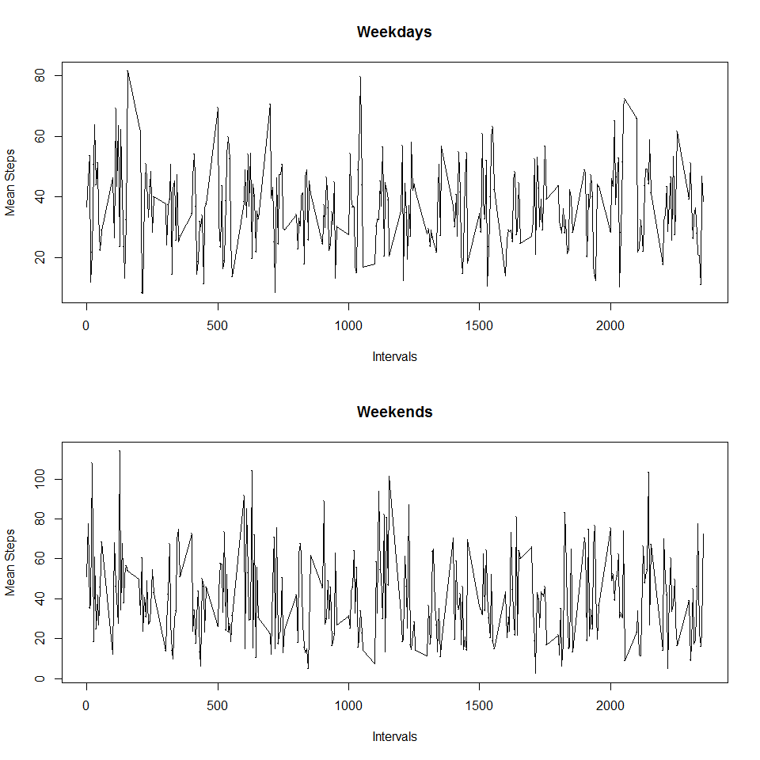

# Reproducible Research - Project 1
David Taylor  
Saturday, December 06, 2014  


# Loading and preprocessing the data

## Setup and Load Source Data (activity.csv)

Set the current working directory and load the file into a data.table.


```r
# assume your working directory is the base of the checked out git project.

# Load initial libraries
library(caret)
```

```
## Loading required package: lattice
## Loading required package: ggplot2
```

```r
library(ProjectTemplate)
library(data.table)

# Load activity csv file into Data.table 
# already downloaded from source:
# https://d396qusza40orc.cloudfront.net/repdata%2Fdata%2Factivity.zip
# and unzipped

DT <- fread('activity.csv')

summary(DT)
```

```
##      steps           date              interval   
##  Min.   :  0.0   Length:17568       Min.   :   0  
##  1st Qu.:  0.0   Class :character   1st Qu.: 589  
##  Median :  0.0   Mode  :character   Median :1178  
##  Mean   : 37.4                      Mean   :1178  
##  3rd Qu.: 12.0                      3rd Qu.:1766  
##  Max.   :806.0                      Max.   :2355  
##  NA's   :2304
```

```r
head(DT)
```

```
##    steps       date interval
## 1:    NA 2012-10-01        0
## 2:    NA 2012-10-01        5
## 3:    NA 2012-10-01       10
## 4:    NA 2012-10-01       15
## 5:    NA 2012-10-01       20
## 6:    NA 2012-10-01       25
```

## Processing of data

Create a Date totals and Average Interval totals across all days.


```r
# Create Sum of Steps per day

DTSum <- DT[,sum(steps,na.rm=TRUE), by=date]

setnames(DTSum,"V1", "total_steps")

summary(DTSum)
```

```
##      date            total_steps   
##  Length:61          Min.   :    0  
##  Class :character   1st Qu.: 6778  
##  Mode  :character   Median :10395  
##                     Mean   : 9354  
##                     3rd Qu.:12811  
##                     Max.   :21194
```

```r
# Create Mean of Intervals data.table over all days.
DTMeanInt <- DT[,mean(steps,na.rm=TRUE), by=interval]

setnames(DTMeanInt, "V1", "mean_steps")

summary(DTMeanInt)
```

```
##     interval      mean_steps    
##  Min.   :   0   Min.   :  0.00  
##  1st Qu.: 589   1st Qu.:  2.49  
##  Median :1178   Median : 34.11  
##  Mean   :1178   Mean   : 37.38  
##  3rd Qu.:1766   3rd Qu.: 52.83  
##  Max.   :2355   Max.   :206.17
```

# What is the mean total number of steps taken per day?
## Histogram and Summary of Total Days per day

Histogram of the Total Steps across different intervals.


```r
hist(DTSum$total_steps, plot=TRUE, xlab="Ranges of Values", ylab="Frequency of Step Interval Counts in ranges", main="Histogram of Step Interval Counts across all Dates")
```

 

Summary of the Total Steps per Date data.


```r
summary(DTSum)
```

```
##      date            total_steps   
##  Length:61          Min.   :    0  
##  Class :character   1st Qu.: 6778  
##  Mode  :character   Median :10395  
##                     Mean   : 9354  
##                     3rd Qu.:12811  
##                     Max.   :21194
```

## Mean and Median Steps in a day

Mean # of steps in a day is *9354.2295* steps.

Median # of steps in a day is *10395* steps.


# What is the average daily activity pattern?

## Interval Average Steps across all days


```r
plot.ts(DTMeanInt$interval, DTMeanInt$mean_steps, pch=".", xlab="5 minute Interval", ylab="Mean of Steps In Interval", main="Mean Steps per 5 Minute Interval over all days")
lines(DTMeanInt$mean_steps ~ DTMeanInt$interval, pch=".")
```

 

## Interval with the most steps during the day:
*835* is the interval with the largest average number of steps across all the dates.


# Imputing missing values

Total count of rows with 'NAs' for steps = 2304 out of 15264 total rows.

## Impute Strategy
Chose to use the *mean count of steps across all days for given interval* that is missing to replace NA values.

## New Dataset: DTImpute.

```r
DTImpute <- data.table(DT)

# Function to impute mean value for 
impute.mean <- function(x) replace (x, is.na(x), mean(x,na.rm=TRUE))

# Replacing the steps with imputed values
DTImpute$steps <- DTImpute[,lapply(.SD,impute.mean), by=interval, .SDcols="steps"]$steps

# Summary of Imputed values
summary(DTImpute)
```

```
##      steps           date              interval   
##  Min.   :  0.0   Length:17568       Min.   :   0  
##  1st Qu.:  0.0   Class :character   1st Qu.: 589  
##  Median :  0.0   Mode  :character   Median :1178  
##  Mean   : 37.4                      Mean   :1178  
##  3rd Qu.: 27.0                      3rd Qu.:1766  
##  Max.   :806.0                      Max.   :2355
```

Create Summary by day from the Imputed data


```r
DTImputeSum <- DTImpute[,sum(steps), by=date]

setnames(DTImputeSum, "V1", "total_steps")

summary(DTImputeSum)
```

```
##      date            total_steps   
##  Length:61          Min.   :   22  
##  Class :character   1st Qu.:  728  
##  Mode  :character   Median :10311  
##                     Mean   :10766  
##                     3rd Qu.:15018  
##                     Max.   :50817
```

Interval Mean from the Imputed data.


```r
DTImputeMeanInt <- DTImpute[,mean(steps), by=interval]

setnames(DTImputeMeanInt, "V1", "mean_steps")

summary(DTImputeMeanInt)
```

```
##     interval      mean_steps  
##  Min.   :   0   Min.   :10.2  
##  1st Qu.: 589   1st Qu.:29.3  
##  Median :1178   Median :38.1  
##  Mean   :1178   Mean   :37.4  
##  3rd Qu.:1766   3rd Qu.:45.9  
##  Max.   :2355   Max.   :74.3
```
## Histogram of total steps taken each day.


```r
hist(DTImputeSum$total_steps, plot=TRUE, xlab="Ranges of Values", ylab="Frequency of Step Interval Counts in ranges", main="Histogram of Imputed Step Interval Counts across all Dates")
```

 

## Mean and Median steps per day in Imputed data:

Mean # of steps in a day is *10766.1887* steps.

Median # of steps in a day is *10310.9811* steps.

## These values diff from the original calculation skipping the NAs:


```r
mean(DTImputeSum$total_steps) - mean(DTSum$total_steps)
```

```
## [1] 1412
```

```r
median(DTImputeSum$total_steps) - median(DTSum$total_steps)
```

```
## [1] -84.02
```


# Weekdays vs. Weekends


```r
# Create the factor column for Weekday / weekend
library(timeDate)

DTImpute2 <- data.table(DTImpute);

DTImpute2$daytype <- DTImpute2[,lapply(.SD,function(x) {ifelse( isWeekday(as.Date(x)), "weekday", "weekend")}), .SDcols="date"]

# create weekdays mean data.table
DTMeanWeekdays <- DTImpute2[daytype == "weekday",mean(steps), by=interval]

setnames(DTMeanWeekdays, "V1", "mean_steps")

# create weekends data.table
DTMeanWeekends <- DTImpute2[daytype == "weekend", mean(steps), by=interval]

setnames(DTMeanWeekends, "V1", "mean_steps")
```

## create panel plot of weekdays vs weekends.

```r
library(lattice)

par(mfrow=c(2,1))

plot.ts(DTMeanWeekdays$interval, DTMeanWeekdays$mean_steps, main="Weekdays", xlab="Intervals", ylab="Mean Steps", lwd=2, pch=".")
lines(DTMeanWeekdays$mean_steps ~ DTMeanWeekdays$interval)

plot.ts(DTMeanWeekends$interval, DTMeanWeekends$mean_steps, main="Weekends", xlab="Intervals", ylab="Mean Steps", lwd=2, pch=".")
lines(DTMeanWeekends$mean_steps ~ DTMeanWeekends$interval)
```

 

